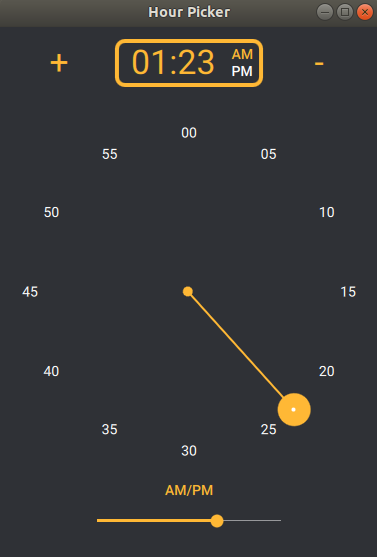

# TimePicker

**TimePicker** is a litte project which allow you to pick a time on European or American Clock. Its components are intended to be a part of **Qaterial** library (Cf [QaterialGallery](https://olivierldff.github.io/QaterialGallery/))

### Overview

#### Hour Picker (EU way)


#### Hour Picker (Am way)


#### Minute Picker



### Build

````bash
git clone https://github.com/CedricLeon/TimePicker.git
mkdir build && cd build
cmake -DCMAKE_PREFIX_PATH=/your/Qt/gcc_64/path ..
make -j2
./TimePicker
````

### Components : Code Example

#### EuCircularHourPicker

Allow to pick hour from 0 to 23 (Eu way)

````js
EuCircularHourPicker
{
    radius: 150			// default: 100
    currentHour: 5		// default: 0
    onAccepted: (hour) => console.log(`hour: ${hour}`)
}
````

#### AmCircularHourPicker

Allow to pick hour from 1 to 12 (American way)

````js
AmCircularHourPicker
{
    radius: 150			// default: 100
    currentHour: 5		// default: 0    
    onAccepted: (hour) => console.log(`hour: ${hour}`)
}
````

#### CircularMinutePicker

Allow to pick minute from 0 to 59

````js
CircularMinutePicker
{
    radius: 150			// default: 100
    currentHour: 28		// default: 0
    onAccepted: (minute) => console.log(`minute: ${minute}`)
}
````

#### CircularPathLabel

Display data in a circular path, is able to highlight an element

````js
CircularPathLabel
{
    radius: 150				// default: 100
    numberOfElement: 5      // default: 12
    model: ["0", "1", "2", "3", "4"] // default: hours of the day
    currentIndex: 3         // "highlighted" element, default: -1
}
````


